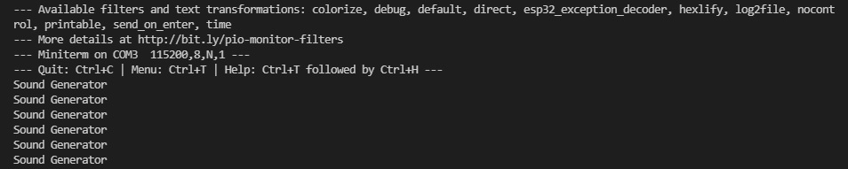

# PRACTICA 7: Buses de comunicación III

## INFORME PARTE A

### Salida por el puerto serie

<!--Images-->

### Explicación del codigo

Primero de todo tenemos la definición de las librerias necesarias para el codigo y las variables in, aac y out que son de clases AudioFileSourcePROGMEM, AudioGeneratorAAC y AudioOutputI2S respectivamente.

En el setup se inicializa el Serial con una velocidad de monitor de 115200 y se asignan nuevas clases a in, aac y out. Hecho esto se define la ganancia de out y por ultimo aac relaciona la entrada (in) con la salida (out).

Por ultimo tenemos el loop que lo que hace es, cuando esta en bucle el aac decodificara, y en cuanto el bucle pare mostrara por el terminal el mensaje "Sound Generator"