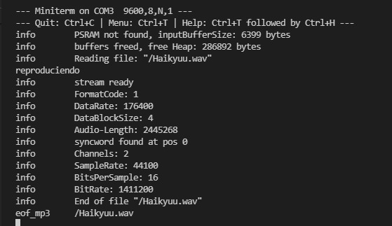

# PRACTICA 7: Buses de comunicación III

## INFORME PARTE B

### Salida por el puerto serie

<!--Images-->

### Explicación del codigo

Por empezar tenemos definidas las librerias necesarias y seguidamente los pines digitales I/O que vamos a utilizar. También se crea un objeto Audio con nombre audio.

En el setup se inicializa la comunicación SPI con el lector SD y el Serial con monitor speed de 115200. Seguidamente se definen en el objeto audio los pines de salida I2S, el volumen de reproducción del audio y el fichero .wav que se va a reproducir de la SD. Seguidamente mostrara por el terminal "reproduciendo"

Una vez inicializado esto tenemos el loop que inicia el objeto audio que hemos definido antes.

Y por ultimo se muestra por el terminal diferente información tecnica sobre el archivo de audio, como podemos ver en la imagen del apartado anterior.

